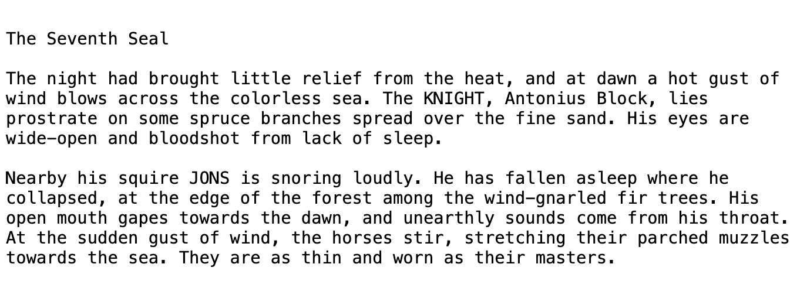

<a href="https://colab.research.google.com/github/krixik-ai/krixik-docs/blob/main/docs/examples/search_pipeline_examples/multi_semantically_searchable_ocr.ipynb" target="_parent"></a>

## *Pipeline* Multimodular: Búsqueda Semántica Sobre ROC (OCR)

Este documento detalla un *pipeline* multimodular que recibe un archivo de imagen como entrada, [`extrae el texto`](../../modulos/modulos_ia/modulo_ocr_roc.md) que contiene, y habilita [`búsqueda semántica`](../../sistema/metodos_de_busqueda/metodo_semantic_search_busqueda_semantica.md) sobre el texto extraído.

El documento está dividido en las siguientes secciones:

- [Monta tu *Pipeline*](#monta-tu-pipeline)
- [Procesa un Archivo de Entrada](#procesa-un-archivo-de-entrada)
- [Búsqueda Semántica](#busqueda-semantica)

### Monta tu *Pipeline*

Para lograr lo arriba descrito, monta un pipeline que consiste de los siguientes módulos en secuencia:

- Un módulo [`ocr` (ROC - Reconocimiento Optico de Caracteres)](../../modulos/modulos_ia/modulo_ocr_roc.md).

- Un módulo [`json-to-txt`](../../modulos/modulos_de_funciones_de_apoyo/modulo_json-to-txt.md).

- Un módulo [`parser` (fragmentación de texto)](../../modulos/modulos_de_funciones_de_apoyo/modulo_parser_fragmentacion.md).

- Un módulo [`text-embedder` (encaje léxico)](../../modulos/modulos_ia/modulo_text-embedder_encaje_lexico.md).

- Un módulo [`vector-db` (base de datos vectorial)](../../modulos/modulos_de_bases_de_datos/modulo_vector-db_base_de_datos_vectorial.md).

Usas la combinación de módulos [`json-to-txt`](../../modulos/modulos_de_funciones_de_apoyo/modulo_json-to-txt.md) y [`parser`](../../modulos/modulos_de_funciones_de_apoyo/modulo_parser_fragmentacion.md), que combina los fragmentos transcritos en un solo documento que luego vuelve a fragmentar, para asegurarte que cualquier quiebre indeseado generado por el ROC no resulte en fragmentos parciales que confundan el modelo de [`encaje léxico`](../../modulos/modulos_ia/modulo_text-embedder_encaje_lexico.md).

Para crear el pipeline usarás el método [`create_pipeline`](../../sistema/creacion_de_pipelines/creacion_de_pipelines.md) de la siguiente manera:


```python
# creación del pipeline descrito
pipeline = krixik.create_pipeline(name="multi_busqueda_semantica_sobre_roc",
                                  module_chain=["ocr", "json-to-txt", "parser", "text-embedder", "vector-db"])
```

### Procesa un Archivo de Entrada

Examina el archivo de prueba antes de continuar:


```python
# examina el archivo de entrada
from IPython.display import Image

Image(filename=data_dir + "input/sello.png")
```


    

    


Usarás los modelos predeterminados en este *pipeline*, así que el argumento [`modules`](../../sistema/parametros_y_procesar_archivos_a_traves_de_pipelines/metodo_process_procesar.md#seleccion-de-modelo-por-medio-del-argumento-modules) del método [`process`](../../sistema/parametros_y_procesar_archivos_a_traves_de_pipelines/metodo_process_procesar.md) no hará falta.


```python
# procesa el archivo a través del pipeline según lo arriba descrito
process_output = pipeline.process(
    local_file_path=data_dir + "input/sello.png",  # la ruta de archivo inicial en la que yace el archivo de entrada
    local_save_directory=data_dir + "output",  # el directorio local en el que se guardará el archivo de salida
    expire_time=60 * 30,  # data de este proceso se eliminará del sistema Krixik en 30 minutos
    wait_for_process=True,  # espera que el proceso termine antes de devolver control del IDE al usuario
    verbose=False, # no mostrar actualizaciones de proceso al ejecutar el código
)
```

Reproduce la salida de este proceso con el siguiente código. Para aprender más sobre cada componente de la salida, estudia la documentación del método [`process`](../../sistema/parametros_y_procesar_archivos_a_traves_de_pipelines/metodo_process_procesar.md).

Dado que la salida de este modelo/módulo es un archivo de base de datos [FAISS](https://github.com/facebookresearch/faiss), `process_output` se muestra como "null". Sin embargo, el archivo de salida se ha guardado en la ubicación indicada bajo `process_output_files`. El `file_id` del archivo procesado es el prefijo del nombre del archivo de salida en esta ubicación.


```python
# nítidamente reproduce la salida de este proceso
print(json.dumps(process_output, indent=2))
```

    {
      "status_code": 200,
      "pipeline": "multi_semantically_searchable_ocr",
      "request_id": "93ad346b-344a-431f-9893-ffd1b55340a7",
      "file_id": "7360a295-435b-4beb-8174-d27aec08aa04",
      "message": "SUCCESS - output fetched for file_id 7360a295-435b-4beb-8174-d27aec08aa04.Output saved to location(s) listed in process_output_files.",
      "warnings": [],
      "process_output": null,
      "process_output_files": [
        "../../../data/output/7360a295-435b-4beb-8174-d27aec08aa04.faiss"
      ]
    }


### Busqueda Semantica

El método [`semantic_search`](../../sistema/metodos_de_busqueda/metodo_semantic_search_busqueda_semantica.md) de Krixik habilita búsqueda semántica sobre documentos procesados a través de ciertos *pipelines*. Dado que el método [`semantic_search`](../../sistema/metodos_de_busqueda/metodo_semantic_search_busqueda_semantica.md) hace [`embedding` (encaje léxico)](../../modulos/modulos_ia/modulo_text-embedder_encaje_lexico.md) con la consulta y luego lleva a cabo la búsqueda, solo se puede usar con *pipelines* que de manera consecutiva contienen los módulos [`text-embedder` (encaje léxico)](../../modulos/modulos_ia/modulo_text-embedder_encaje_lexico.md) y [`vector-db` (base de datos vectorial)](../../modulos/modulos_de_bases_de_datos/modulo_vector-db_base_de_datos_vectorial.md).

Ya que tu *pipeline* satisface esta condición tiene acceso al método [`semantic_search`](../../sistema/metodos_de_busqueda/metodo_semantic_search_busqueda_semantica.md). Úsalo de la siguiente manera para consultar el texto con lengua natural:


```python
# haz búsqueda semántica sobre el texto procesado por el pipeline
semantic_output = pipeline.semantic_search(query="The man sounds like he's dying.", file_ids=[process_output["file_id"]])

# nítidamente reproduce la salida de esta búsqueda
print(json.dumps(semantic_output, indent=2))
```

    {
      "status_code": 200,
      "request_id": "b354328b-2588-49bb-b034-d81c0eb5fd68",
      "message": "Successfully queried 1 user file.",
      "warnings": [],
      "items": [
        {
          "file_id": "7360a295-435b-4beb-8174-d27aec08aa04",
          "file_metadata": {
            "file_name": "krixik_generated_file_name_lhmyxspuwj.png",
            "symbolic_directory_path": "/etc",
            "file_tags": [],
            "num_vectors": 8,
            "created_at": "2024-06-05 14:50:50",
            "last_updated": "2024-06-05 14:50:50"
          },
          "search_results": [
            {
              "snippet": "His eyes are\nwide-open and bloodshot from lack of sleep.",
              "line_numbers": [
                5,
                6
              ],
              "distance": 0.284
            },
            {
              "snippet": "His\nopen mouth gapes towards the dawn, and unearthly sounds come from his throat.",
              "line_numbers": [
                9,
                10
              ],
              "distance": 0.289
            },
            {
              "snippet": "He has fallen asleep where he\ncollapsed, at the edge of the forest among the wind-gnarled fir trees.",
              "line_numbers": [
                8,
                9
              ],
              "distance": 0.302
            },
            {
              "snippet": "Nearby his squire JONS is snoring loudly.",
              "line_numbers": [
                7,
                8
              ],
              "distance": 0.331
            },
            {
              "snippet": "At the sudden gust of wind, the horses stir, stretching their parched muzzles\ntowards the sea.",
              "line_numbers": [
                11,
                12
              ],
              "distance": 0.429
            }
          ]
        }
      ]
    }

