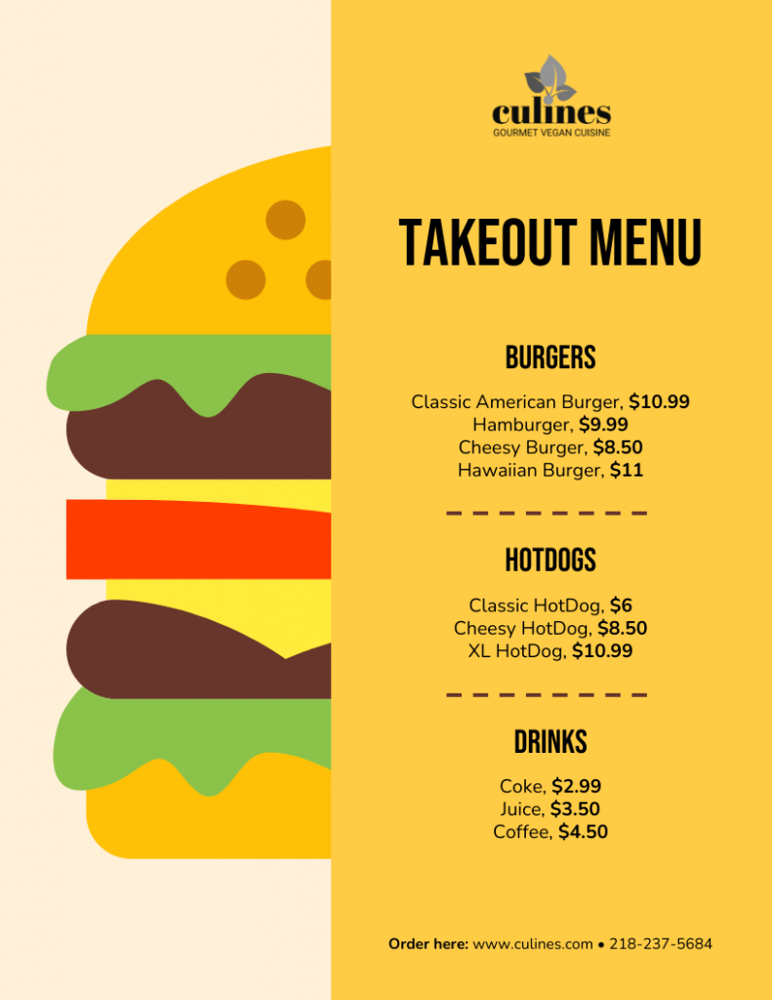

<a href="https://colab.research.google.com/github/krixik-ai/krixik-docs/blob/main/docs/examples/single_module_pipelines/single_ocr.ipynb" target="_parent"></a>

## Single-Module Pipeline: `ocr`

This document is a walkthrough of how to assemble and use a single-module pipeline that only includes an [`ocr`](../../modules/ai_modules/ocr_module.md) module. 

Optical Character Recognition (OCR) is a technology that converts different types of documents, such as scanned paper documents, PDFs, and images captured by a digital camera, into editable and searchable data by extracting and organizing all text from the source document. OCR applications include digitizing printed texts for archiving, automating data entry processes, enabling text-to-speech for accessibility, and extracting information for machine learning and data analytics.

The document is divided into the following sections:

- [Pipeline Setup](#pipeline-setup)
- [Required Input Format](#required-input-format)
- [Using the Default Model](#using-the-default-model)
- [Using a Non-Default Model](#using-a-non-default-model)

### Pipeline Setup

Let's first instantiate a single-module [`ocr`](../../modules/ai_modules/ocr_module.md) pipeline.

We use the [`create_pipeline`](../../system/pipeline_creation/create_pipeline.md) method for this, passing only the [`ocr`](../../modules/ai_modules/ocr_module.md) module name into `module_chain`.


```python
# create a pipeline with a single ocr module
pipeline = krixik.create_pipeline(name="single_ocr_1", module_chain=["ocr"])
```

### Required Input Format

The [`ocr`](../../modules/ai_modules/ocr_module.md) module accepts `.png`, `.jpg`, and `.jpeg` images as [input](../../modules/ai_modules/ocr_module.md#inputs-and-outputs-of-the-ocr-module).

Let's take a quick look at a valid input file, and then process it.


```python
# examine the contents of a valid input file, this example taken from --> https://venngage.com/templates/menus/yellow-burger-takeout-menu-70bd168b-7813-44d4-9581-c7b6ab1c0f67
from IPython.display import Image

Image(filename=data_dir + "input/menu_1.png")
```


    

    


### Using the Default Model

Let's process our test input file using the [`ocr`](../../modules/ai_modules/ocr_module.md) module's [`default model`](../../modules/ai_modules/ocr_module.md#available-models-in-the-ocr-module): [`tesseract-en`](https://github.com/tesseract-ocr/tesseract).

Given that this is the default model, we need not specify model selection through the optional [`modules`](../../system/parameters_processing_files_through_pipelines/process_method.md#selecting-models-via-the-modules-argument) argument in the [`process`](../../system/parameters_processing_files_through_pipelines/process_method.md) method.


```python
# process the file with the default model
process_output = pipeline.process(
    local_file_path=data_dir + "input/menu_1.png",  # the initial local filepath where the input file is stored
    local_save_directory=data_dir + "output",  # the local directory that the output file will be saved to
    expire_time=60 * 30,  # process data will be deleted from the Krixik system in 30 minutes
    wait_for_process=True,  # wait for process to complete before returning IDE control to user
    verbose=False,
)  # do not display process update printouts upon running code
```

Part of the output of this process is printed below—for readability, text box coordinates have been excluded. To learn more about each component of the output, review documentation for the [`process`](../../system/parameters_processing_files_through_pipelines/process_method.md) method.

Because the output of this particular module-model pair is a JSON file, the process output is provided in this object as well (this is only the case for JSON outputs).  Moreover, the output file itself has been saved to the location noted in the `process_output_files` key.  The `file_id` of the processed input is used as a filename prefix for the output file.


```python
print(process_output["process_output"][0]["text"])
```

    culines
    
    GOURMET VEGAN CUISINE
    
    TAKEOUT MENU
    
    BURGERS
    
    Classic American Burger, $10.99
    Hamburger, $9.99
    Cheesy Burger, $8.50
    Hawaiian Burger, $11
    
    HOTDOGS
    
    Classic HotDog, $6
    Cheesy HotDog, $8.50
    XL HotDog, $10.99
    
    DRINKS
    
    Coke, $2.99
    Juice, $3.50
    Coffee, $4.50
    
    Order here: www.culines.com e 218-237-5684
    
    
    

To confirm that everything went as it should have, let's load in the text file output from `process_output_files`:


```python
# load in process output from file - here we only print the text detected, and not the detection boxes, since that output is quite long
with open(process_output["process_output_files"][0]) as f:
    print(json.load(f)[0]["text"])
```

    culines
    
    GOURMET VEGAN CUISINE
    
    TAKEOUT MENU
    
    BURGERS
    
    Classic American Burger, $10.99
    Hamburger, $9.99
    Cheesy Burger, $8.50
    Hawaiian Burger, $11
    
    HOTDOGS
    
    Classic HotDog, $6
    Cheesy HotDog, $8.50
    XL HotDog, $10.99
    
    DRINKS
    
    Coke, $2.99
    Juice, $3.50
    Coffee, $4.50
    
    Order here: www.culines.com e 218-237-5684
    
    
    

### Using a Non-Default Model

To use a [non-default model](../../modules/ai_modules/ocr_module.md#available-models-in-the-ocr-module) like [`tesseract-es`](https://github.com/tesseract-ocr/tesseract), we must enter it explicitly through the [`modules`](../../system/parameters_processing_files_through_pipelines/process_method.md#selecting-models-via-the-modules-argument) argument when invoking the [`process`](../../system/parameters_processing_files_through_pipelines/process_method.md) method.


```python
# process the file with a non-default model
process_output = pipeline.process(
    local_file_path=data_dir + "input/menu_1.png",  # all arguments but modules are the same as above
    local_save_directory=data_dir + "output",
    expire_time=60 * 30,
    wait_for_process=True,
    verbose=False,
    modules={"ocr": {"model": "tesseract-es"}},
)  # specify a non-default model for this process
```

The output of this process is printed below. Although the input image has English text instead of Spanish (the model's language), all English characters are in the Spanish alphabet, so it will work well for our purposes. An English-specific OCR model might not work as well for Spanish-language text in an image.

Because the output of this particular module-model pair is a JSON file, the process output is provided in this object as well (this is only the case for JSON outputs).  Moreover, the output file itself has been saved to the location noted in the `process_output_files` key.  The `file_id` of the processed input is used as a filename prefix for the output file.


```python
# load in process output from file - here we only print the text detected, and not the detection boxes, since that output is quite long
print(process_output["process_output"][0]["text"])
```

    culines
    
    GOURMET VEGAN CUISINE
    
    TAKEOUT MENU
    
    BURGERS
    
    Classic American Burger, $10.99
    Hamburger, $9.99
    Cheesy Burger, $8.50
    Hawaiian Burger, $11
    
    HOTDOGS
    
    Classic HotDog, $6
    Cheesy HotDog, $8.50
    XL HotDog, $10.99
    
    DRINKS
    
    Coke, $2.99
    Juice, $3.50
    Coffee, $4.50
    
    Order here: www.culines.com e 218-237-5684
    
    
    
